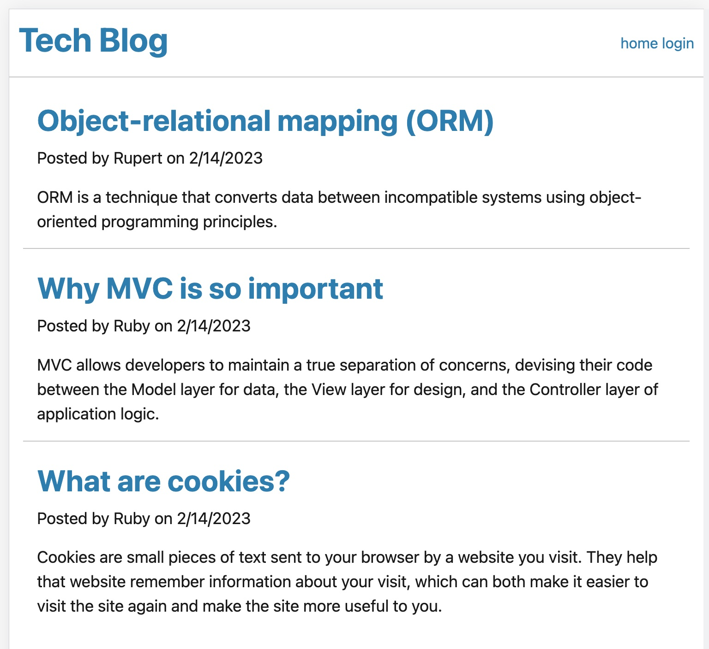
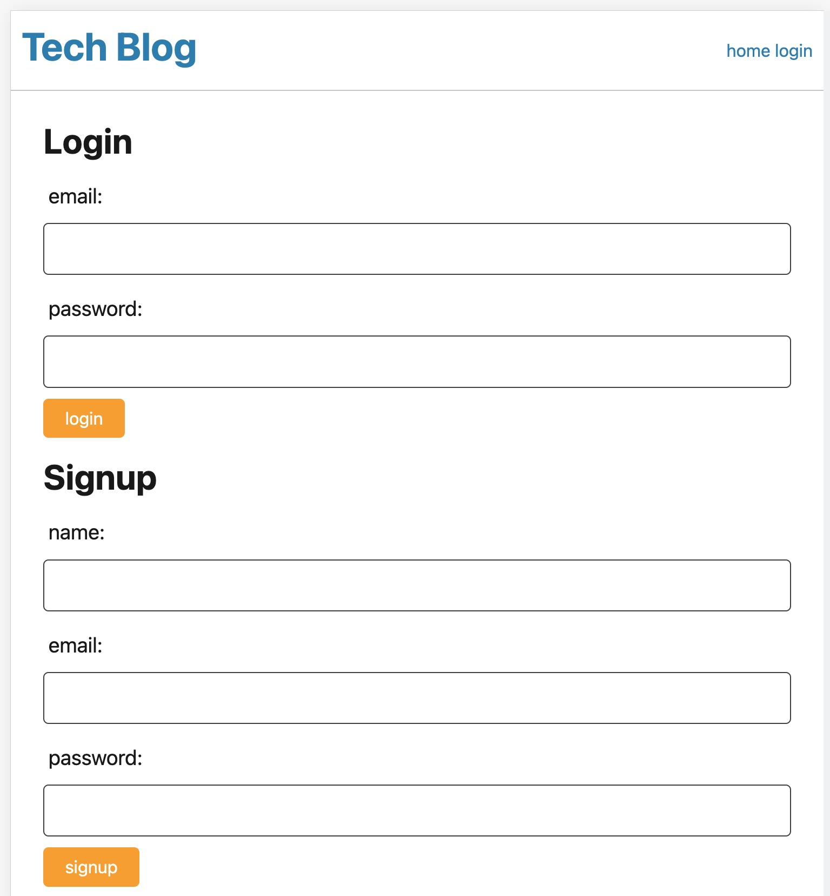
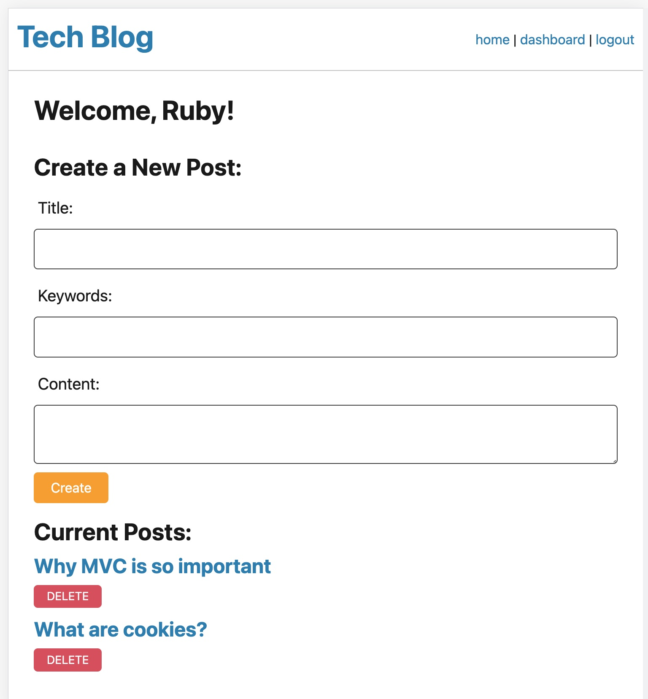
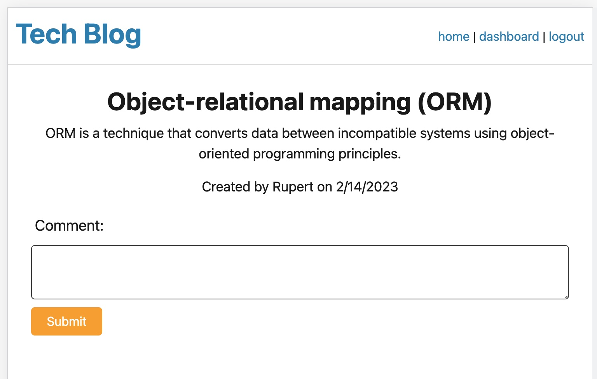

# Tech Blog

Link to Heroku Deployed site: [https://https://hidden-tor-85503.herokuapp.com//](https://https://hidden-tor-85503.herokuapp.com//)

## Description

This is a CMS-style blog site where developers can publish their blog posts and comment on other developer's posts as well. It is another tool to supplement a developer's continous learning journey - not only creating new apps and debugging existing code bases, but also to connect with the dev community by sharing technical concepts and recent advancements and new technologies.

## Installation

This application uses Handlebars.js as the templating language, Sequelize as the ORM, and the express-session npm package for authentication. The application is deployed using Heroku.

## Preview & Usage

1. Run npm install, update .env credientials and run start.
2. Visit a localhost:PORT which takes you to the home page; click on log in or sign up to continue.
2. Once logged in, you can publish a blog post.
3. Once created, it will be listed in the home page where others can also read and make comments.
4. As needed, you can also delete posts. As a future development, will be adding a function that allows updating a post. 

## License

There were no licenses obtained for this project. For more information on licenses, follow this link:
[https://choosealicense.com/](https://choosealicense.com/).